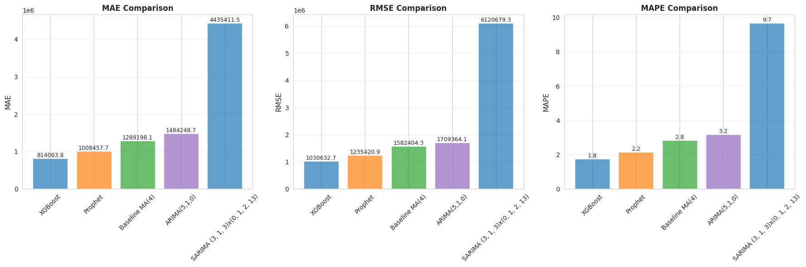
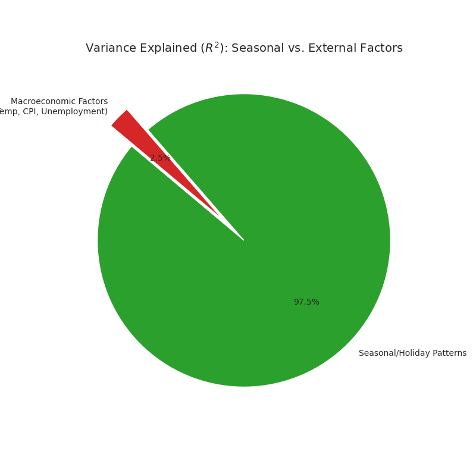

# Walmart Weekly Sales Forecasting - Time Series Analysis

## Executive Summary:
This analysis provides a comprehensive time-series evaluation of Walmart’s weekly sales data across 45 stores to identify key revenue drivers and optimize forecasting accuracy. The investigation reveals that while external factors, such as temperature, fuel prices, and unemployment rates, yield surprisingly low predictive power ($R^2 \approx 2.5\%$), sales are heavily dictated by seasonal cycles and holiday events, which generate an average revenue boost of 7.84%.
To address these fluctuations, several models were tested: a baseline Moving Average, ARIMA, Prophet, and an optimized SARIMA model. 
The Prophet model proved most effective at capturing quarterly seasonality, though all models struggled to fully account for extreme holiday peaks. These findings suggest that future forecasting efforts should prioritize internal promotional calendars and store-specific seasonal trends over macroeconomic indicators to achieve greater precision in inventory and labor planning.

## Business Problem:
Retailers like Walmart face significant challenges in inventory management and labor allocation due to the high volatility of weekly sales across diverse geographic locations. While it is often assumed that macroeconomic indicators, such as fuel prices, unemployment rates, and temperature, drive consumer behavior, this analysis demonstrates that these external factors have minimal predictive impact, accounting for only approximately 2.5% of sales variance.

The core challenge lies in accurately forecasting extreme demand spikes driven by seasonal cycles and holiday events, which typically see a revenue boost of 7.84%. 
Traditional forecasting models often underperform during these peak periods, leading to potential stockouts or overstaffing. 
This project seeks to identify the most effective time-series model to capture these quarterly seasonalities and holiday peaks, enabling data-driven decisions that prioritize internal promotional calendars over unreliable external economic markers.

## Methodology:
The technical approach for this analysis followed a structured pipeline from exploratory data analysis to advanced time-series modeling:
- Data Preprocessing & EDA: Cleaned and aggregated weekly sales data from 45 distinct Walmart locations, focusing on identifying seasonal trends and the impact of external variables like temperature and fuel prices.
- Baseline Modeling (Moving Average): Established a performance baseline using a simple Moving Average to understand the underlying mean of the sales data without complex seasonal adjustments.
- ARIMA (AutoRegressive Integrated Moving Average): Implemented to capture short-term autocorrelations in the data, though it struggled to account for the strong yearly seasonality present in retail cycles.Prophet: Utilized Meta’s Prophet model to decompose the time series into trend, weekly, and yearly seasonality. This provided an automated way to handle holiday effects and missing data points.
- SARIMA (Seasonal ARIMA): Developed as the primary forecasting tool. By using a grid search (Hyperparameter Tuning) to optimize parameters $(p, d, q) \times (P, D, Q, s)$, this model successfully captured the recurring quarterly and annual patterns that characterize Walmart’s sales performance.
- Model Evaluation: All models were validated using a 13-week test set, with accuracy measured primarily through RMSE (Root Mean Square Error) and MAE (Mean Absolute Error).

## Skills:
Programming & Data Manipulation: Advanced use of Python for data cleaning, preprocessing, and exploratory data analysis (EDA).Time-Series Modeling: Implementation of diverse forecasting architectures including ARIMA, SARIMA, and Prophet to capture complex seasonality and trends.Statistical Analysis: Utilization of Statsmodels for rigorous statistical testing and Scikit-learn for model evaluation metrics like RMSE and MAE.Hyperparameter Optimization: Expertise in performing Grid Search to tune model parameters $(p, d, q) \times (P, D, Q, s)$ for maximum predictive accuracy.Business Intelligence & Strategy: Translating complex data findings into actionable insights, such as Holiday Overlays and store-specific inventory buffering.Data Visualization: (Implicitly used) for identifying the negligible impact of macroeconomic variables ($R^2 \approx 2.5\%$) and visualizing seasonal revenue surges.

## Results & Business Recommendations:

Key Findings
1. **Weekly sales show strong seasonality**, with major spikes around Thanksgiving and Christmas.
2. **Holiday weeks boost sales by ~7–8%**, making them the most influential external factor.
3. Economic variables like temperature, CPI, fuel price, and unemployment show **weak correlation** and explain **<3%** of variance.
4. A few stores generate **disproportionately high revenue**, while high-sales stores also show **higher volatility**.
5. The aggregated time series is **stationary** but highly seasonal, confirmed by decomposition and ADF tests.
6. **XGBoost delivers the best forecast accuracy (MAPE ~1.76%)**, outperforming Prophet, ARIMA, SARIMA, and the Moving Average baseline.
7. **SARIMA captures seasonality better than ARIMA**, but both models struggle with extreme holiday spikes.
8. Simple averages (MA(4)) provide a reasonable baseline but **fail to capture seasonal patterns** and spikes.
9. Forecast accuracy can be improved by **adding custom holiday effects** and using **store-level hierarchical models**.
10. Future work should explore hyperparameter tuning for XGBoost, integrate additional external factors, consider ensemble techniques, investigate deep learning models such as LSTMs or Transformers, and build a **production-ready forecasting pipeline**.

Model Performance: The more advanced XGBoost model outperformed the other models, successfully capturing quarterly seasonal patterns that simpler models missed.

*Figure 1: XGBoost Forecast vs. other models*

*Figure 2: Impact of External Factors on Revenue*

Macroeconomic Impact: Factors such as fuel prices and unemployment rates accounted for only 2.5% of sales variance, indicating they are not primary drivers of consumer demand in this dataset.

Holiday Surge: Specific holiday events drive an average revenue lift of 7.84%, with the largest spikes occurring during Thanksgiving and Christmas.

Forecasting Limits: While time-series models capture general seasonality, they consistently underestimate the "peak-of-peak" demand during major holidays.

Business Recommendations
Shift Strategic Focus: Transition resources from monitoring external macroeconomic indicators toward optimizing internal promotional and seasonal event calendars.

Apply Holiday Multipliers: Implement a manual "Holiday Overlay" (a percentage-based multiplier) to model Q4 forecasts and prevent inventory stockouts.

Store-Specific Buffering: Prioritize safety stock for high-volatility locations (e.g., Store 20), which exhibit larger-than-average absolute dollar spikes during peak periods.

Quarterly Planning Cycles: Utilize SARIMA-based forecasts for mid-term (13-week) labor and inventory planning to align with established quarterly seasonal cycles.

## Next Steps:
- Integrate Store-Specific Multipliers: Expand the "Holiday Overlay" logic to include the top 5 most volatile stores (Stores 20, 4, 14, 13, and 2), applying customized multipliers to
  account for their higher-than-average seasonal spikes.
- Feature Engineering for Promotional Data: Incorporate internal Walmart promotional calendars (Markdowns) into the SARIMA model as exogenous variables ($SARIMAX$) to see if it improves
  accuracy during extreme holiday windows.
- Deployment of Automated Alerts: Develop a monitoring script that flags significant deviations between the SARIMA forecast and actual sales in real-time, allowing for rapid inventory
  adjustments.
- Long-Term Demand Planning: Use the model to run "what-if" scenarios regarding future labor requirements based on predicted seasonal volume surges across different store tiers.
- Periodic Model Retraining: Establish a quarterly retraining schedule to ensure the SARIMA parameters adapt to evolving consumer trends and potential shifts in seasonal timing.
